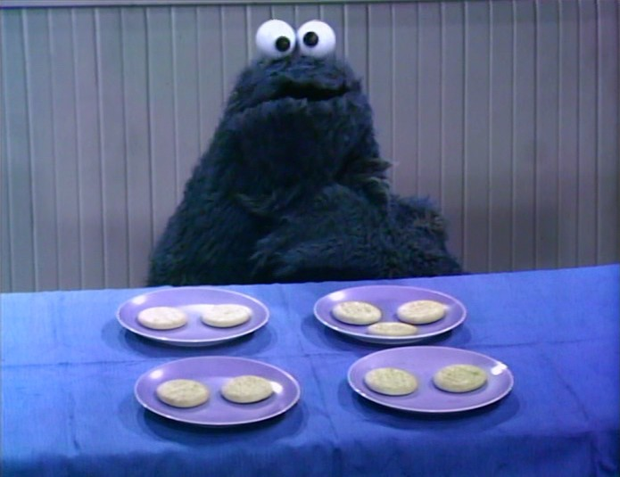

```{r setup, include=FALSE}
knitr::opts_chunk$set(echo = TRUE)
knitr::opts_chunk$set(message = FALSE)
knitr::opts_chunk$set(warning =  FALSE)
knitr::opts_chunk$set(fig.width=4.25)
knitr::opts_chunk$set(fig.height=4.0)
knitr::opts_chunk$set(fig.align='center') 
knitr::opts_chunk$set(fig.pos = 'H')
knitr::opts_chunk$set(results='hold') 
```

```{r,echo=FALSE}
setwd('C:/AlexFiles/SugerSync/UIC/Teaching/Graduate/543-Fall2018/Week 3')
```


\pagebreak

Note: There is some very complex R code used to generate today's lecture. I have hidden it in the PDF file. If you see `echo=FALSE` inside the RMD file, it means that is the code you are not expected to understand or learn. I will explain the functions you will need to learn. 

# Design Example
> Interested in how 'trusting' people feel for their partner after engaging in various levels of joint action. 2 People enter the lab (one is a confederate) and are asked to either a) move chairs independently, b) Move a couch together, and confederate helps c) Move a couch together and confederate hinders. Moving a couch requires the two people to coordinate their action. After the study ends, people rate how trustworthy their partner seems (1-7, with 6 = high trust).
  
No Joint Action | Helpful Joint Action | Disrupted Joint Action
----------------|----------------------|------------------------
2               | 5                    | 2
3               | 4                    | 3
5               | 7                    | 3
3               | 4                    | 1
2               | 5                    | 1
M = 3           | M = 5                | M = 2 
SS = 6          | SS = 6               | SS = 4 

## Comparing 3 groups
So, to do t-tests, I would have to compare G1 vs. G2, G2 vs. G3, G1 vs. G3. This becomes a problem when I have more 4+ groups. There are statistical reasons we cannot do this, such as each time we do this we risk committing a type I error (A dead Salmon will teach us this lesson in a week).  So, we need some way to test all three groups at once to know if at least one group is different from another. So how do I compare three groups (or more) at once? I know let's just fix the t-test formula!

$$ t = \frac{M_1 - M_2 - M_3} {\sqrt{\frac{S^2_p}{n_1}+ \frac{S^2_p}{n_2}+\frac{S^2_p}{n_3}}} $$
What is wrong with my fix? 

# Analysis of Variance
- Analysis of variance (ANOVA) is the procedure to test hypotheses with two or treatments
- ANOVA can handle multiple samples while t-tests can only be calculated for two samples 
- ANOVA used to decide whether 
    - The treatments have no effect
    - Treatments do have differences 


## ANOVAs vs. t-tests
ANOVAs are closely related to t-tests, $F = t^2$ (This is why the F-distribution thus has no tails). Hypothesis testing with ANOVAs is just like with t-tests. t-tests are essentially a ratio of [mean difference over noise (error/chance)], and ANOVA is an F ratio (variance caused by you over variance due to noise) 


### Types of One-way ANOVAs
- Fixed-factor ANOVAs which will be the focus of the rest of the semester
- Random-factor ANOVAs have been replacing by Mixed-Models which I teach a whole course on 

## Terms
- FACTOR: Independent or quasi-independent variable (the manipulated variable)
- Factors can have *LEVELS* that make up the factor

> For example, you are testing how temperature (factor) affects concentration. You test four groups at four different temperate (levels) to see what temperature has the strongest effect.  

## Types of studies
- Like t-tests, you can do a repeated measures design or independent measures design
    - Repeated measure design is where the same subject is tested multiple times (over the course of time)
    - Independent measures design is where a separate group is used for each factor (we will focus on these for a few weeks)
- Mixed design: a combination of repeated measures and in independent measures (we will cover review this design after we learn about the repeated measures and independent measures ANOVA)

## Logic of ANOVA

ANOVA asks is "One of these things not like the other"


{width=50% height=50%}


$H_0$ All groups have equal means

$H_1$ At least 1 group is different from the other 

It does not tell which is different and it does not have tails (for reasons you will see below). We will report to how to figure out which is different next class.  

### Logic of F-testing
- First, we need to analyze the variance (it's in them of the ANOVA right?)
  - There two concepts we need to solve $$F = \frac{S^2_{Treatment}}{S^2_{Error}}$$
    - Between-treatments variance: we will calculate the variance between groups! *This is the variance we* **caused**.
    - Within-treatment variance: the variance within each cell is the error term. *That is the variance due to* **chance**. We need to assume (just like our T-test) that variance in group 1 = group 2 = group 3 (Assumption: Homogeneity of variance: HOV)
- We can rewrite our F-test to be, $F = \frac{S^2_{B}}{S^2_{W}}$

> Note: ANOVA uses a more technical name for variance mean squared deviation scores (or $MS$ for short). Thus, when you see $MS$ its **equivalent conceptually** to $S^2$. [Root-MS **equivalent conceptually** $S$]. In both cases, I cannot say $MS$ = $S^2$ for mathematical reasons...  

- So, in most people will recognize: $$F = \frac{MS^2_{B}}{MS^2_{W}}$$ 

### Between-Subjects Variance
- Two explanations for between-treatment variance:
    - Treatment effect
    - Chance
        - Individual differences: what if one person likes it cold and others function better at very warm temps
        - Experimental error: just by taking the measurement you can cause an error

### Within-Subjects Variance
- One explanation for Within-treatment variance [if any only if HOV is meet and you have no confounding or nuisance variables]
    - Noise/chance differences (individual differences)
> However, imagine you had different RAs running each condition and they each screwed up the instructions differently (condition is confounded with RA which could affect the mean differences or simply add variance you should have controlled for)

### F-Ratio Logic
$$F= \frac{MS^2_{B}}{MS^2_{W}}$$

$$F= \frac{Treatment + Noise}{Noise}$$
if Treatment = 0

$$F= \frac{0 + Noise}{Noise} = 1$$ 

Thus, $F = 1$ you have no treatment effect.

But if Treatment = 3, Noise = 1

$$F= \frac{Treatment + Noise}{Noise} = \frac{3 + 1}{1} = 3 $$

Thus, your signal is 3 times your noise! 

# Analysis Procedures

We return to our study data. We will run our analysis first by hand and examine each stage of the calculation. We will next do it in R. 

No Joint Action | Helpful Joint Action | Disrupted Joint Action
----------------|----------------------|------------------------
2               | 5                    | 2
3               | 4                    | 3
5               | 7                    | 3
3               | 4                    | 1
2               | 5                    | 1
M = 3           | M = 5                | M = 2 
SS = 6          | SS = 6               | SS = 4 

## By Hand Calculation 
Simplified formulas for equal sample sizes.

### Between-Subject Variance
Remember that $S^2 = \frac{SS}{n-1} =\frac{\Sigma(X-M)^2}{n-1}$. We can transform this, $MS_{B} = \frac{SS_{B}}{k-1} =\frac{n \Sigma(M-G)^2}{df_{BT}}$, where $G = \frac{\Sigma{M}}{K}$ [Grand mean] and $K$ = # Levels of the Factor, $n$ = # of people per cell [Note: This formula works in equal sample sizes only]

#### Calculation
1. $K = 3$
2. $G = \frac{{3+5+2}}{3} = 3.33$
3. $df_{BT} = 3-1 = 2$
4. $n = 5$
4. $SS_{BT} = 5*[(3-3.33)^2+(5-3.33)^2+(2-3.33)^2] = 23.33$
4. $MS_{BT} = \frac{SS_{B}}{df_{B}}= \frac{23.33}{2} = 11.67$

### Within-Subject Variance
Here we simply calculate the $MS_{WT} = \frac{SS_{W}}{N-K} =\frac{\Sigma(SS_{cell})}{df_{W}}$. $SS_{W} = \Sigma(X-M)^2$ per group and sum it.  

#### Calculation
1. $N = n*k = 5*3 = 15$
2. $df_{W} = 15-3 = 12$
3. $SS_{W} = 6+6+4 = 16$
4. $MS_{W} = \frac{16}{12} = 1.33$

### F-value
1. $F = \frac{MS_B}{MS_W} = \frac{11.67}{1.33} = 8.75$


### Significance
You will need to look up two things on F-table:  $df_{Num}$ & $df_{dem}$. The degrees of freedom that when into the numerator and the degrees of freedom that go into the denominator. See hand out for tables and this SHINY APP: https://shiny.rit.albany.edu/stat/fdist/

The $F_{crit}$ changes with $df$ as in t-test. When K = 2, $F_{crit} = t_{crit}^2$


## Helper Table
That is hard to track, so we build a source table to help us track what we are doing

Source | SS     | DF     | MS     | F
-------|--------|--------|--------|----
Between| $SS_B$ | $df_B$ | $MS_B$ | F
Within | $SS_W$ | $df_W$ | $MS_W$ | 
Total  | $SS_T$ | $df_T$ 

With the formulas (formal equations)

Source | SS     | DF     | MS     | F
-------|--------|--------|--------|----
Between| $n\displaystyle\sum_{i=1}^{k}(M_i-G)^2$ | $K-1$ | $\frac{SS_B}{df_B}$ | $\frac{MS_B}{MS_W}$
Within | $\displaystyle \sum_{i=1}^{K}\sum_{j=1}^{n}(X_{i_{j}}-M_i)^2$| $N-K$ | $\frac{SS_W}{df_W}$ | 
Total  | $\displaystyle\sum_{j=1}^{N}(X_j-G)^2$  | $N-1$ 

With the formulas (conceptually simplified)

Source | SS     | DF     | MS     | F
-------|--------|--------|--------|----
Between| $nSS_{treatment}$ | $K-1$ | $\frac{SS_B}{df_B}$ | $\frac{MS_B}{MS_W}$
Within | $\displaystyle \sum SS_{within}$| $N-K$ | $\frac{SS_W}{df_W}$ | 
Total  | $SS_{scores}$   | $N-1$ 

Note: $SS_B + SS_W = SS_T$ & $df_B + df_W = df_T$

## Effect size
we cannot use Cohen's $d$, instead we will use eta-squared = percentage of variance the treatment accounts for. Remember $SS_B$ is the variation caused by treatment and $SS_T$ is the variation of Treatment + Noise. 
$$\eta^2 = \frac{SS_B}{SS_B+SS_W} = \frac{SS_B}{SS_T}$$  

This eta-squared formula for one-way ANOVA is equal to the more modern generalized-eta squared $\eta^2_g$. So R will report $\eta^2_g$ (Bakeman, 2005). We will report to these formulas in the future. 

Note: $\eta^2_g$ will always yield values larger than population, and there are corrections (but they are not often reported). They are $\omega^2$ and $\omega^2_g$.

$$\omega^2 = \frac{SS_B-(K-1)MS_W}{SS_T+MS_W}$$

### Understanding $\eta^2$ (or $\omega^2$)
$\eta^2$ is a useful method for understanding how your ANOVA "parsed" your variance. In fact,$\eta^2$ = $R^2$ from regression (which is how much your line explains the dots). The reason we can get the percentage of variance accounted for is because ANOVA is actually a special case of regression. 

```{r, echo = FALSE}
SSb=5*((3-3.33)^2+(5-3.33)^2+(2-3.33)^2)
SSw=4+6+6
n2=SSb/(SSb+SSw)

slices <- c(n2,1-n2) 
lbls <- c("Treatment", "Error")
pct <- round(slices/sum(slices)*100)
lbls <- paste(lbls, pct) # add percent to labels 
lbls <- paste(lbls,"%",sep="") # ad % to labels 
pie(slices,labels = lbls, col=rainbow(length(lbls)),
  	main="Pie Chart of Parsed Variance: \nEta-Sq")
```

```{r, echo = FALSE}
SSb=5*((3-3.33)^2+(5-3.33)^2+(2-3.33)^2)
SSw=4+6+6
MSw=SSw/12
SSt=SSb+SSw
k=3
omega2=(SSb-(k-1)*MSw)/(SSt+MSw)

slices <- c(omega2,1-omega2) 
lbls <- c("Treatment", "Error")
pct <- round(slices/sum(slices)*100)
lbls <- paste(lbls, pct) # add percent to labels 
lbls <- paste(lbls,"%",sep="") # ad % to labels 
pie(slices,labels = lbls, col=rainbow(length(lbls)),
  	main="Pie Chart of Parsed Variance: \nOmega-Sq")
```


### Effect Size for Power
For power analysis, we will need $f$, which is what Cohen developed (like $d$ for t-tests)

$$f = \sqrt{\frac{K-1}{K}\frac{F}{n}} $$

ES  |Value | Size
----|------|----------
$f$ | .1   | Small effect
$f$ | .25  | Medium effect
$f$ | .4   | Large effect


$f_{observed}$ = `r round(((2/3)*(8.75/5))^.5,3)`, Large effect!


## By R Functions
The formulas I provided will work when there are equal sample sizes and no missing data. When you have unbalanced cells, choices have to be made about how to parse the variance because ANOVA is a special case of regression. We will use Type III Sums of squares. I will explain in future lectures the different methods to parse the variance. 

No Joint Action | Helpful Joint Action | Disrupted Joint Action
----------------|----------------------|------------------------
2               | 5                    | 2
3               | 4                    | 3
5               | 7                    | 3
3               | 4                    | 1
2               | 5                    | 1
M = 3           | M = 5                | M = 2 
SS = 6          | SS = 6               | SS = 4 


### Build our data frame
We can read in the data into R via csv file, or we can hand type the data frame. This is what I have done below. 

```{r}
n=5; k=3;
JA.Study<-
  data.frame(SubNum=seq(1:(k*n)),
           Condition=ordered(
                      c(rep("No",n),
                       rep("Helpful",n),
                       rep("Distrupted",n))
                      ),
           DV=c(2,3,5,3,2,5,4,7,4,5,2,3,3,1,1))
```

You can `View(JA.Study)` it see as well

### Check the means and SS calculations with dpylr
```{r}
library(dplyr)
Means.Table<-JA.Study %>%
  group_by(Condition) %>%
  summarise(N=n(),
            Means=mean(DV),
            SS=sum((DV-Means)^2),
            SD=sd(DV),
            SEM=SD/N^.5)
knitr::kable(Means.Table, digits = 2) 
# Note remember knitr::kable makes it pretty, but you can just call `Means.Table`
```

Good are means and SS match, so I data entered it correctly. 


###  Run ANOVA
`afex` is a package developed to allow people to do SPSS-like ANOVA in R (type III: R defaults to Type I, which will talk about later). It had many output formats, but for us the most useful are (Anova, nice). These output formats allows to see different things and use the objects it creates in different ways.

#### Anova style output
- This style is close to our ANOVA source table, but instead its formatted like a regression F-source table. 
- You can ignore the intercept line (we will cover that next semester). 
- Condition = $SS_B$ and the name will always match your IV name. 
- Residual = Error.  Residual in regression means leftover (and this it the error term: chance)
- There is no total (you can do that with addition)

```{r}
library(afex)

ANOVA.JA.Table<-aov_car(DV~Condition + Error(SubNum), 
                  data=JA.Study, return='Anova')
ANOVA.JA.Table
```

#### Nice style output
- This style reports everything you need to report in APA format! That's why its called `nice`, cause its nice to you!

```{r}
library(afex)

Nice.JA.Table<-aov_car(DV~Condition + Error(SubNum), 
                  data=JA.Study, return='nice')
Nice.JA.Table
```

# Assumptions 
We assume HOV and normality. We can test for HOV using Brown-Forsythe formula. Brown-Forsythe formula subtracts the median within each cell and recalculated the ANOVA. If there is not variance imbalance we should see a result very similar to the middle plot below (the pvalue  > .05: non-significant). If violate this assumption, there is special ANOVA called the Brown-Forsythe ANOVA (but no one reports it).

Using the `HH` package, we can visualize our violations.  As you can see the middle plot show no deviation. 

```{r, fig.height=4, fig.width=7.5}
library(HH)
hov(DV~Condition, data=JA.Study)
hovPlot(DV~Condition, data=JA.Study) 
```

Testing for normality with such a small sample does not make sense. In general normality tests tend to be overly sensitive (Shapiro-Wilk test). Often we examine QQ plots of the DV. If the data points are very different from the line, it suggests violations of normality. 

```{r, fig.height=3, fig.width=3}
qqnorm(JA.Study$DV)
qqline(JA.Study$DV)
```


# APA style Report
$F(df_n,df_d) = x.xx, p = 0.xx, \eta_g^2 = 0.xx$

A one-way between subjects ANOVA was conducted to compare the effect of joint action on feelings of trust in no, helpful, and disrupted joint action. There was a significant effect of joint action on feelings of trust, $F(2,12) = 8.75, p < 0.01, \eta_g^2 = 0.59$. 

## Plot ANOVA
Normally we plot bar graphs with 1 SEM unit. I used the object I created `Means.Table` that has the means. Also, I want to re-set the order using the `factor` command and set the order I want.  We will apply some fancy code to make our plot more APA!

```{r, fig.height=2, fig.width=3}
library(ggplot2)

Means.Table$Condition<-factor(Means.Table$Condition, 
                              levels = c("No","Distrupted","Helpful"),
                              labels = c("No","Distrupted","Helpful"))

Plot.1<-ggplot(Means.Table, aes(x = Condition, y = Means))+
  geom_col()+
  scale_y_continuous(expand = c(0, 0))+ # Forces plot to start at zero
  geom_errorbar(aes(ymax = Means + SEM, ymin= Means - SEM), 
                position=position_dodge(width=0.9), width=0.25)+
  xlab('Joint Action')+
  ylab('Mean Trust Rating')+
  theme_bw()+
  theme(panel.grid.major=element_blank(),
        panel.grid.minor=element_blank(),
        panel.border=element_blank(),
        axis.line=element_line(),
        legend.title=element_blank())
Plot.1
```


# References
Bakeman, R. (2005). Recommended effect size statistics for repeated measures designs. Behavior research methods, 37(3), 379-384.


