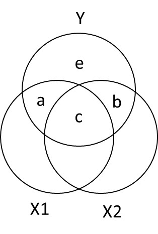

```{r, echo=FALSE, warning=FALSE}
setwd('C:/Users/AlexUIC/Box Sync/UIC Teaching/545 Regression Spring 2019/Week 2 - Part and Partial Correlations')
```


```{r setup, include=FALSE}
# setup for Rnotebooks
knitr::opts_chunk$set(echo = TRUE) #Show all script by default
knitr::opts_chunk$set(message = FALSE) #hide messages 
knitr::opts_chunk$set(warning =  FALSE) #hide package warnings 
knitr::opts_chunk$set(fig.width=4.25) #Set default figure sizes
knitr::opts_chunk$set(fig.height=4.0) #Set default figure sizes
knitr::opts_chunk$set(fig.align='center') #Set default figure
knitr::opts_chunk$set(fig.show = "hold") #Set default figure

```

\pagebreak

# Correlations with 2 or more variables
- Correlations with more than 2 variables present a new challenge 
- What if a third variable (X2) actually explains the relationship between X1 and Y?
- We need to find a way to figure out how X2 might relate to X1 and Y! 

## Example
- Practice Time (X1)
- Performance Anxiety (X2)
- Memory Errors (Y)
- Question, how much does Practice Time and Performance Anxiety predict/explain Memory Errors in performance
- Lets simulate our dataset with the new variables and generate a specific correlation matrix

Variable                 |  Practice Time (X1) | Performance Anxiety (X2) | Memory Errors (Y) 
-------------------------|---------------------|--------------------------|-------------------
Practice Time (X1)       |           1         |          .3              |     .6        
Performance Anxiety (X2) |           .3        |          1               |     .4        
Memory Errors (Y)        |           .6        |          .4              |     1         

- Set the mean number for each variable to be 10

```{r, out.width='.49\\linewidth', fig.width=3.25, fig.height=3.25,fig.show='hold',fig.align='center'}
#packages we will need to conduct to create and graph our data
library(MASS) #create data
library(car) #graph data
py1 =.6 #Cor between X1 (Practice Time) and Memory Errors
py2 =.4 #Cor between X2 (Performance Anxiety) and Memory Errors
p12= .3 #Cor between X1 (Practice Time) and X2 (Performance Anxiety)
Means.X1X2Y<- c(10,10,10) #set the means of X and Y variables
CovMatrix.X1X2Y <- matrix(c(1,p12,py1,
                            p12,1,py2,
                            py1,py2,1),3,3) # creates the covariate matrix 
#build the correlated variables. Note: empirical=TRUE means make the correlation EXACTLY r. 
# if we say empirical=FALSE, the correlation would be normally distributed around r
set.seed(42)
CorrDataT<-mvrnorm(n=100, mu=Means.X1X2Y,Sigma=CovMatrix.X1X2Y, empirical=TRUE)
#Convert them to a "Data.Frame" & add our labels to the vectors we created
CorrDataT<-as.data.frame(CorrDataT)
colnames(CorrDataT) <- c("Practice","Anxiety","Memory")
#make the scatter plots
scatterplot(Memory~Practice,CorrDataT, smoother=FALSE)
scatterplot(Memory~Anxiety,CorrDataT, smoother=FALSE)
scatterplot(Anxiety~Practice,CorrDataT, smoother=FALSE)
# Pearson Correlations
ry1<-cor(CorrDataT$Memory,CorrDataT$Practice)
ry2<-cor(CorrDataT$Memory,CorrDataT$Anxiety)
r12<-cor(CorrDataT$Anxiety,CorrDataT$Practice)
```

### What the problem?
- Practice Time can explain Memory Errors, $r^2 =$ `r ry1^2`
- Anxiety can explain Memory Errors, $r^2 =$ `r ry2^2`
- But how we do know whether Practice Time and Anxiety are explaining the same variance? Anxiety and Practice Time explain each other a little, $r^2 =$ `r r12^2`

### Multiple R 
- We use the capital letter, $R$, now cause we have multiple variables
- $R_{Y.12} = \sqrt{\frac{r_{Y1}^2 + r_{Y2}^2 - 2r_{Y1} r_{Y2} r_{12}} {1 - r_{12}^2}}$
- $R_{Y.12} =$ `r sqrt((ry1^2+ry2^2 - 2*ry1*ry2*r12)/(1-r12^2))`
- if we square that value, `r sqrt((ry1^2+ry2^2 - 2*ry1*ry1*r12)/(1-r12^2))^2`, we get the Multiple $R^2$ 
    - i.e., the total variance explained by these variables on Memory 

\pagebreak

# Semipartial (part) correlation
- We need to define to contribution of each X variable on Y
- Semipartial (also called part) is one of two methods; the other is called partial
    - is called semi, cause it removes the effect of one IV relative to the other without removing the relationship to Y
-  **Semipartial correlations indicate the "unique" contribution of an independent variable on the dependent variable**.  
    - When we get to back to regression, "What is the contribution of this X above and beyond the other X variable?" 

<center>
{ width=20% }
</center>


- $R_{Y.12}^2 = a + b + c$
- $sr_1^2: a = R_{Y.12}^2 - r_{Y2}^2$
- $sr_2^2:b = R_{Y.12}^2 - r_{Y1}^2$

## Calcuation
- Calculate unique variance

```{r}
R2y.12<-sqrt((ry1^2+ry2^2 - (2*ry1*ry2*r12))/(1-r12^2))^2
a = R2y.12 -ry2^2 
b = R2y.12 -ry1^2 
```

- In other words,
    - In total we explained, `r R2y.12` of the Memory Errors 
    - Practice Time uniquely explained, `r a` of Memory Errors
    - Anxiety uniquely explained, `r b` of Memory Errors 
    - We should not solve for *c* cause it can be negative (in some weird cases)

## Seeing control in action in regression
- Another way to understand it: 
    - What if you want to know about Memory Errors and how Practice Time uniquely explains it? 
        - *Controlling the effect of Anxiety on Practice Time*

### Memory (Y) ~ Practice(X1) [Control Anxiety (X2)]
1. We can remove the effect of Anxiety on Practice Time by extracting the residuals from *lm(X1~X2)*
2. Remember the residuals are the leftover (after extracting what was explainable)

```{r, out.width='.49\\linewidth', fig.width=3.25, fig.height=3.25,fig.show='hold',fig.align='center'}
scatterplot(Anxiety~Practice,CorrDataT, smoother=FALSE)
CorrDataT$Practice.control.Anxiety<-residuals(lm(Practice~Anxiety, CorrDataT))
scatterplot(Anxiety~Practice.control.Anxiety,CorrDataT, smoother=FALSE)
```
   
3. Next we can correlate Memory Errors with the residualized Practice Time, *cor(Memory,Practice[control Anxiety])* 

```{r}
Sr1.alt<-cor(CorrDataT$Memory,CorrDataT$Practice.control.Anxiety)
```

If we square the correlation value we got `r Sr1.alt`, it becomes `r Sr1.alt^2` which matches our $a$ from the analysis above. 

### Memory (Y) ~ Anxiety(X2) [Control Practice (X1)]

1. We can remove effect of Practice on Anxiety by extracting the residuals from *lm(X2~X1)*
2. Remember the residuals are the leftover (after extracting what was explainable)

```{r, out.width='.49\\linewidth', fig.width=3.25, fig.height=3.25,fig.show='hold',fig.align='center'}
scatterplot(Practice~Anxiety,CorrDataT, smoother=FALSE)
CorrDataT$Anxiety.control.Practice<-residuals(lm(Anxiety~Practice, CorrDataT))
scatterplot(Practice~Anxiety.control.Practice,CorrDataT, smoother=FALSE)
```
   
3. Next we can correlate Memory Errors with the residualized Anxiety, *cor(Memory,Anxiety[control Practice])* 

```{r}
Sr2.alt<-cor(CorrDataT$Memory,CorrDataT$Anxiety.control.Practice)
```

If we square the correlation value we got `r Sr2.alt`, it becomes `r Sr2.alt^2` which matches our $b$ from the analysis above. 

- **In regression when we have more than one predictors they are controlling for each other!**

## Semipartial notes: 
- It can be written as $sr$ or more specifically, $sr_1$ for X1 (with X2 removed) and $sr_2$ (with X1 removed) 
- correlations with no control variables are called the *zero-order* correlations
- in R you can calculate the $sr$ rather quickly using the *ppcor* library
- The last variable in the list is the control

```{r}
library(ppcor)
Sr1<-spcor.test(CorrDataT$Memory, CorrDataT$Practice, CorrDataT$Anxiety)
Sr2<-spcor.test(CorrDataT$Memory, CorrDataT$Anxiety, CorrDataT$Practice)
# Extract result call for Sr1$estimate
```

- The *Semi-partial* correlation between Memory and Practice (but controlling for Anxiety) was $sr$ =`r round(Sr1$estimate,3)`
    - If we square it becomes $sr^2$ = `r round(Sr1$estimate^2,3)` which matches our $a$ from the analysis above. 

- The *Semi-partial* correlation between Memory and Anxiety (but controlling for Practice) was $sr$ = `r round(Sr2$estimate,3)`
    - If we square it becomes $sr^2$ =  `r round(Sr2$estimate^2,3)` which matches our $b$ from the analysis above. 

## Relationship to Regression 
- Lets say we want to report how practice is related to memory in performance, but we want to control for anxiety?
- The $sr^2$ for a variable tells us how much $R^2$ will decrease if that variable is removed from the regression equation
    -  **Lets test it**
    - Lets run 3 regression models (I zscored everything to make the scales all the same)
        - lm(Memory ~ Practice) 
        - lm(Memory ~ Anxiety)  
        - lm(Memory ~ Practice + Anxiety)
        
```{r}
# Center variables (if you said scale = TRUE it would zscore the predictors)
CorrDataT$Memory.Z<-scale(CorrDataT$Memory, scale=TRUE, center=TRUE)[,]
CorrDataT$Practice.Z<-scale(CorrDataT$Practice, scale=TRUE, center=TRUE)[,]
CorrDataT$Anxiety.Z<-scale(CorrDataT$Anxiety, scale=TRUE, center=TRUE)[,]
###############Model 1
M.Model.1<-lm(Memory.Z~ Practice.Z, data = CorrDataT)
M.Model.2<-lm(Memory.Z~ Anxiety.Z, data = CorrDataT)
M.Model.3<-lm(Memory.Z~ Practice.Z+Anxiety.Z, data = CorrDataT)
```

```{r, ,results='asis'}
library(stargazer)
stargazer(M.Model.1,M.Model.2,M.Model.3,type="latex",
          intercept.bottom = FALSE, single.row=TRUE, 
          star.cutoffs=c(.05,.01,.001), notes.append = FALSE,
          header=FALSE)
```

\pagebreak

Thus, $$R_{model.3_{P+A}}^2 - sr_{Anxiety}^2  =  R^2_{Practice.only}$$

- In R code: 
```{r}
R2.Practice.only = (summary(M.Model.3)$r.squared) - (Sr2$estimate^2)
```

- So `r R2.Practice.only` = $R_{Model.1_{Practice}}^2$, as expected 

Thus, $$R_{model.3.P+A}^2 - sr_{Practice}^2  =  R^2_{Anxiety.only}$$

- In R code: 
```{r}
R2.Anxiety.only = (summary(M.Model.3)$r.squared) - (Sr1$estimate^2)
```
- So `r R2.Anxiety.only` = $R_{Model.2_{Anxiety}}^2$, as expected 

### Residualized into Regression
- Lets take our residualised effects: Practice (controlling for Anxiety) &  Anxiety (controlling for Practice) and compare them to regression model where we enter the two variables into are regression
    - If our regression is semi-partialing we should get the same estimates (if we z-score everything cause residuals we are using are z-scored)

```{r, ,results='asis'}
M.Model.4<-lm(Memory.Z~ Practice.control.Anxiety, data = CorrDataT)
M.Model.5<-lm(Memory.Z~ Anxiety.control.Practice, data = CorrDataT)

stargazer(M.Model.3,M.Model.4,M.Model.5,type="latex",
          intercept.bottom = FALSE, single.row=TRUE, 
          star.cutoffs=c(.05,.01,.001), notes.append = FALSE,
          header=FALSE)
```

- The regression matches our results of when we by-hand residualized

# Partial correlation
- Partial correlation asks how much of the Y variance, which is not estimated by the other IVs, is estimated by this variable.
- It removes the shared variance of the control variable (Say X2) from both Y and X1. 

- $pr_1^2: = \frac{a}{a+e} = \frac{R_{Y.12}^2 - r_{Y2}^2}{1-r_{Y2}^2}$
- $pr_2^2: \frac{b}{b+e} = \frac{R_{Y.12}^2 - r_{Y1}^2}{1-r_{Y1}^2}$

## Seeing control in action
Another way to understand it: 

- What if you want to know about Memory Errors and Practice Time while controlling for Anxiety on both Practice Time and Anxiety (cause Anxiety affect both Memory and Practice Time)
    - We take residuals of lm(Y~X2) and correlate it with the residuals of lm(X1~X2)
        - Remember the residuals are the leftover (after extracting what was explainable)
    - if you want to control for Practice Time you would: residuals of lm(Y~X1) with the residuals of lm(X2~X1)

```{r, out.width='.49\\linewidth', fig.width=3, fig.height=3,fig.show='hold',fig.align='center'}
# Control for Anxiety
CorrDataT$Memory.control.Anxiety<-residuals(lm(Memory~Anxiety, CorrDataT))
CorrDataT$Practice.control.Anxiety<-residuals(lm(Practice~Anxiety, CorrDataT))
scatterplot(Memory.control.Anxiety~Practice.control.Anxiety,CorrDataT, smoother=FALSE)

# Control for Practice Time
CorrDataT$Memory.control.Practice<-residuals(lm(Memory~Practice, CorrDataT))
CorrDataT$Anxiety.control.Practice<-residuals(lm(Anxiety~Practice, CorrDataT))
scatterplot(Memory.control.Practice~Anxiety.control.Practice,CorrDataT, smoother=FALSE)
```

### Correlations based on residuals
```{r}
library(apa)
Res.pr1<-cor_apa(cor.test(CorrDataT$Practice.control.Anxiety,CorrDataT$Memory.control.Anxiety,
                 method = c("pearson")),format ="latex",print = FALSE)
Res.pr2<-cor_apa(cor.test(CorrDataT$Anxiety.control.Practice,CorrDataT$Memory.control.Practice,
                 method = c("pearson")),format ="latex",print = FALSE)
```

- The pearson correlation Memory (controling for Anxiety) and Practice (controling for Anxiety) was `r Res.pr1`
- The pearson correlation Memory (controling for Practice) and Anxiety (controling for Practice)was `r Res.pr2`

### Correlations based on R Functions
- in R you can calculate the $pr$ directly via the functions

```{r}
pr1<-pcor.test(CorrDataT$Memory, CorrDataT$Practice, CorrDataT$Anxiety)
pr2<-pcor.test(CorrDataT$Memory, CorrDataT$Anxiety, CorrDataT$Practice)
```

- The *Partial* correlation between Memory (controlling for Anxiety) and Practice (controlling for Anxiety) was $pr$ =`r round(pr1$estimate,2)`
    - If we square it becomes $pr^2$ = `r round(pr1$estimate^2,2)`

- The *Partial* correlation between Memory (controlling for Practice) and Anxiety (controlling for Practice) was $pr$ = `r round(pr2$estimate,2)`
    - If we square it becomes $pr^2$ =  `r round(pr2$estimate^2,2)`
- **These values all match our hand residualized calculations**

## Partial Correlation in Regression?
- What if control for Anxiety? 
    - We lose the effect of Anxiety

```{r, ,results='asis'}
Partial.Model.1<-lm(Memory.control.Anxiety~ Practice.control.Anxiety+Anxiety.Z, 
                    data = CorrDataT)

stargazer(Partial.Model.1,type="latex",
          intercept.bottom = FALSE, single.row=TRUE, 
          star.cutoffs=c(.05,.01,.001), notes.append = FALSE,
          header=FALSE)
```

\pagebreak

- What if control for Practice? 
    - We lose the effect of Practice
    
    ```{r, ,results='asis'}
Partial.Model.2<-lm(Memory.control.Practice~ Anxiety.control.Practice+Practice.Z, 
                    data = CorrDataT)

stargazer(Partial.Model.2,type="latex",
          intercept.bottom = FALSE, single.row=TRUE, 
          star.cutoffs=c(.05,.01,.001), notes.append = FALSE,
          header=FALSE)
```
